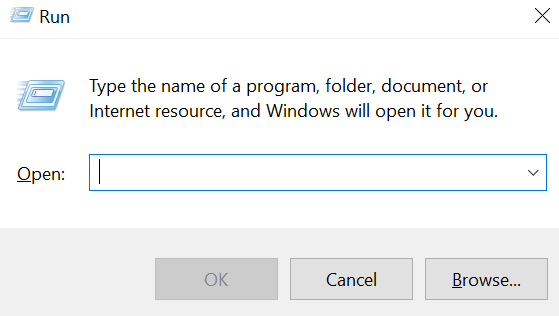
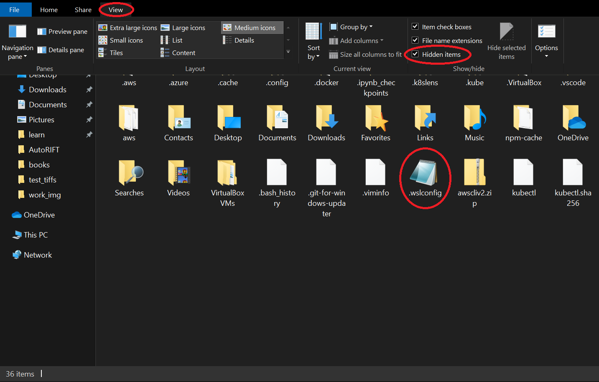
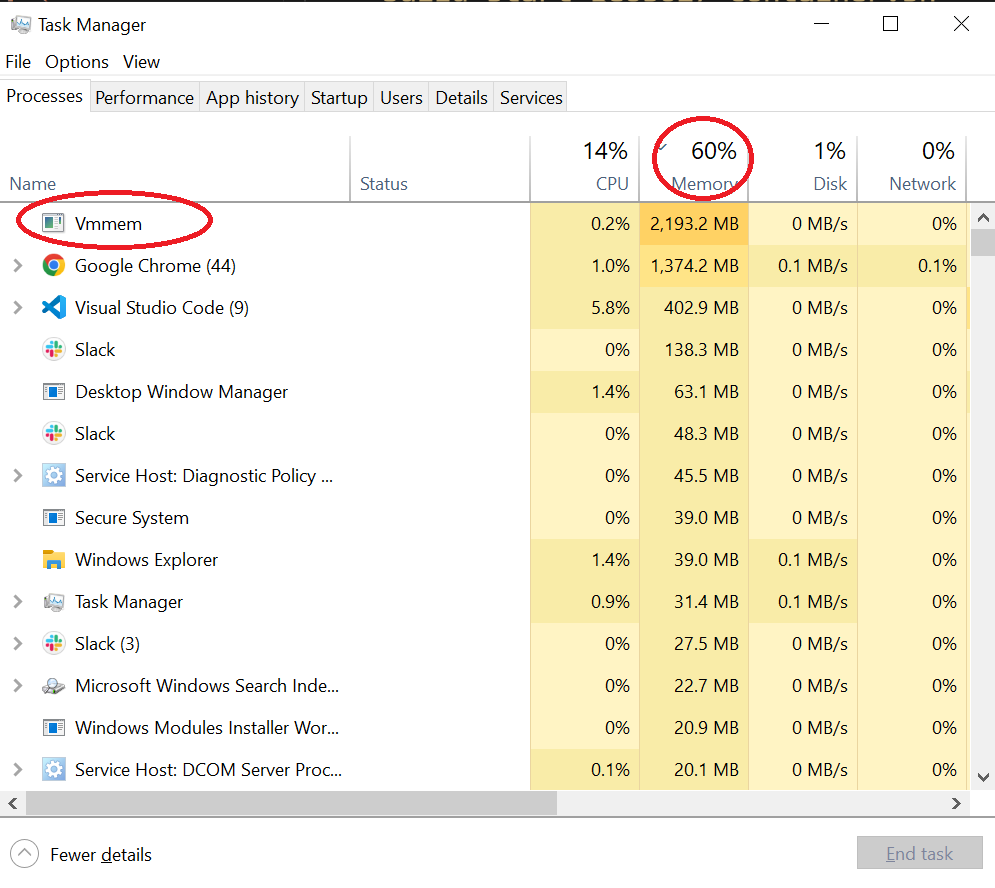

# Building the GEOS627 Image and Running it in a Docker Container

**Note: M1 Macs are not currently supported.**

## For Windows User:
---
Running Docker is easier if you were to use WSL2, which is a paired down version of Linux running on Windows 10+.

- [WSL2 Installation Instructions](https://docs.microsoft.com/en-us/windows/wsl/install)
    - Install the terminal as described in the final optional step on the page linked above

**Important Note for Windows User**:
Running WSL2 and Docker may occasionally consume lot of resources. This can slow down your computer and sometimes crash programs that you are currently running (e.g. Google Chrome). If you are having issue with absurd memory consumption, you may need to set a consumption limit for your WSL2. 

Here are some ways that you can limit your memory consumption by WSL2:

- Press <kbd></kbd> + <kbd>R</kbd> to open *Run Dialog*.

It should look something like this:



- Enter `%UserProfile%` to open your user directory. It should look something like this:



When you open your user directory, go to `View`, check the `Hidden items` checkbox, and look for `.wslconfig` file. If you do not see this file (i.e. if this was your first time opening user directory), make a new `.wslconfig` file.

Once you have a `.wslconfig`, open this file with a text editor of your choice and write following code snippet:

``` bash
[wsl2]
memory=4GB
guiApplications=false
```

*Some important notes regarding `.wslconfig`:*
- Memory limit doesn't necessary have to be 4GB. You may adjust them based on your hardware specification.
- You may need to restart your WSL2. One way to do this is by running `wsl --shutdown` command on Powershell. Once it's shutdown, reopen WSL2.
    - To open a powershell, type in `powershell` in run dialog.


To monitor your resource usage, open Task Manager with <kbd>ctrl</kbd> + <kbd>shift</kbd> + <kbd>Esc</kbd> and look for `vmmem`. If `vmmem` is taking up memory, you may want to shutdown WSL.

Your task manager should look something like this:



## Install Docker
---
- [Windows Instructions using WSL2](https://docs.docker.com/desktop/windows/install/)
    - 
- [Mac Instructions](https://docs.docker.com/desktop/mac/install/)
    - X86 Mac support only
- [Linux instructions](https://docs.docker.com/engine/install/ubuntu/)
    - Select your linux flavor from the left sidebar menu

## Install Git
---
- Install
    - [Linux and Mac Instructions](https://git-scm.com/book/en/v2/Getting-Started-Installing-Git)
    - Windows
        - Follow the Linux instructions, running them in a WSL2 terminal
- Create an SSH key
    - If you previously installed git outside of WSL 2, you may need to generate a new ssh key
    - [Instructions](https://docs.github.com/en/authentication/connecting-to-github-with-ssh/generating-a-new-ssh-key-and-adding-it-to-the-ssh-agent)
- Register your SSH key with GitHub
    - If using WSL 2 on Windows, note that your SSH keys will be stored in `/home//.ssh/`
    - [Instructions](https://docs.github.com/en/authentication/connecting-to-github-with-ssh/adding-a-new-ssh-key-to-your-github-account)


## Clone the Git Repository to Your Computer
---
- If you are using Windows:
    - Open WSL2 terminal
    - Move to your Linux home directory using `cd ~/`
- Once you are in Linux side of WSL, run `git clone git@github.com:ASFOpenSARlab/opensarlab-docker.git` to clone the repo using ssh or `git clone https://github.com/ASFOpenSARlab/opensarlab-docker.git` to clone it using https.

- If you are using Mac OSX:
    - In a terminal, move to the case-sensitive volume you created using the instructions above
    - run `git clone git@github.com:ASFOpenSARlab/opensarlab-docker.git` to clone the repo using shh or `https://github.com/ASFOpenSARlab/opensarlab-docker.git` to clone it using https.

- If you are using Ubuntu:
    - Open your terminal
    - run `git clone git@github.com:ASFOpenSARlab/opensarlab-docker.git` to clone the repo using ssh or `https://github.com/ASFOpenSARlab/opensarlab-docker.git` to clone it using https.


## Change into a Directory Holding `build_start_geos627_container.sh`
---
`build_start_geos627_container.sh` is a script that will start up the geos627 environment. Since this script is in a root directory, you can run one of the two commands on your terminal to start the container:

- Option 1: `bash build_start_geos627_container.sh 2>&1 | tee log` 
- Option 2: `make`

## If You Encounter Issues
---
- Please reach out for support
- Support contact: [uaf-jupyterhub-asf+unavco@alaska.edu](uaf-jupyterhub-asf+unavco@alaska.edu)