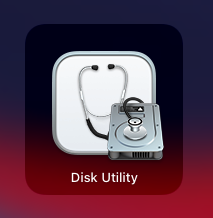
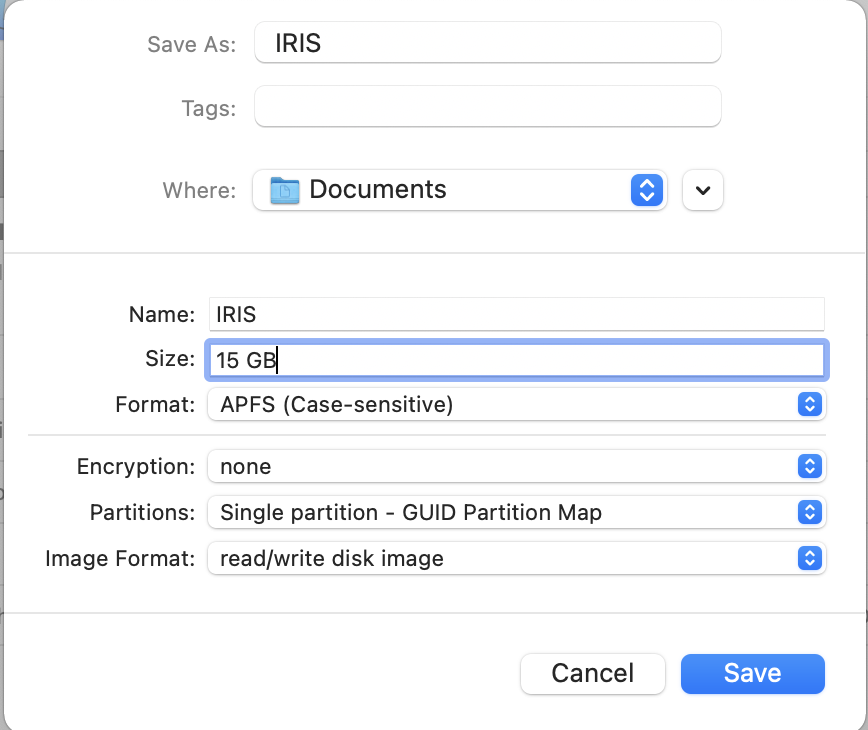
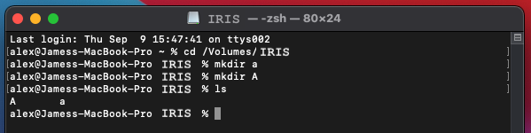
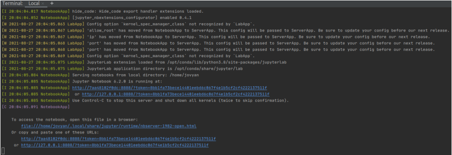
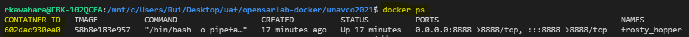
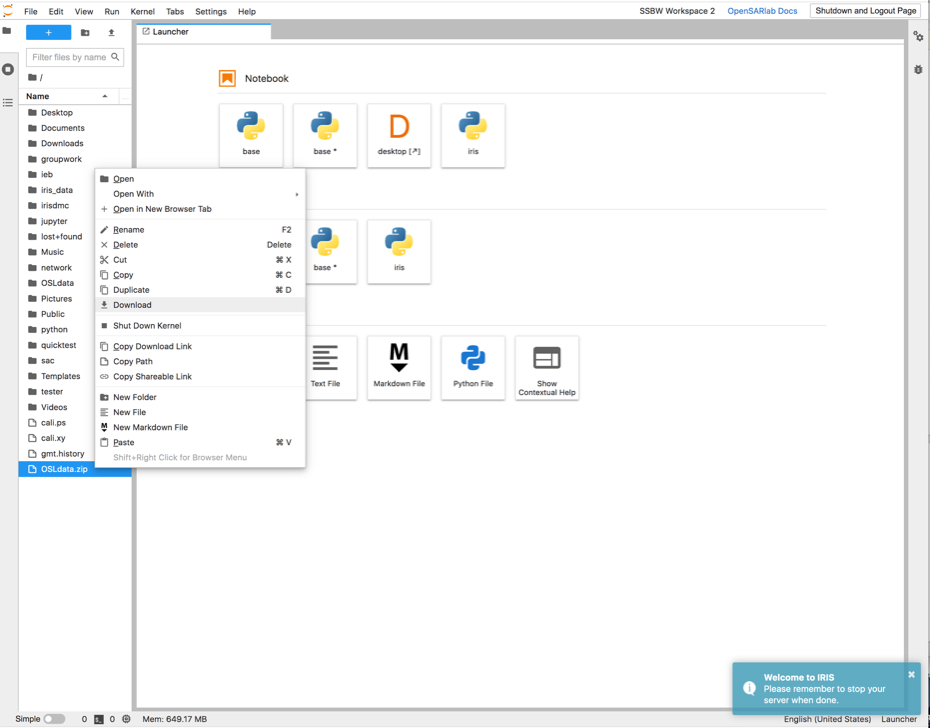
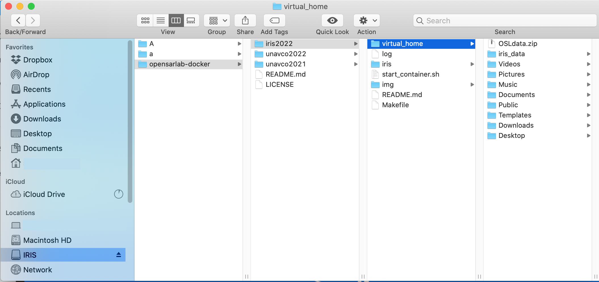

# **Building the IRIS Docker Image and Running it in a Docker Container**

## *Table of Contents*
- [**Installation**](#installation)
    - [Install WSL2 (Windows)](#install-wsl2)
    - [Install Docker](#install-docker)
    - [Install Git](#install-git)
- [**Environment Set Up**](#environment-set-up)
    - [Create a Case-Sensitive Disc Image (MacOS)](#create-a-case-sensitive-disc-image)
    - [Before Cloning the Git Repository](#before-cloning-the-git-repository)
        - [Windows](#windows)
        - [MacOS](#macos)
        - [Ubuntu](#ubuntu)
    - [Cloning Repository](#cloning-repository)
        - [ssh](#ssh)
        - [https](#https)
    - [Move to the IRIS Directory](#move-to-the-iris-directory)
- [**Running IRIS**](#running-iris)
    - [Image Build and Run](#image-build-and-run)
        - [(Optional) Build the Image Without Running](#optional-build-the-image-without-running)
        - [(Optional) Run Container Without Rebuilding](#optional-run-container-without-rebuilding)
    - [IRIS Container](#iris-container)
        - [Open Jupyter in Your Browser](#open-jupyter-in-your-browser)
        - [Stop Your Container](#stop-your-container)
        - [Run the Container Again](#run-the-container-again)
- [**Migrating from OSL to Docker**](#migrating-from-osl-to-docker)
    - [Compress Directories to a Zip File](#compress-directories-to-a-zip-file)
    - [Download Zip File to Your Computer](#download-zip-file-to-your-computer)
    - [Copy Zipped File to Docker](#copy-zipped-file-to-docker)
    - [Unzip the Zipped File](#unzip-the-zipped-file)
- [**Troubleshooting**](#troubleshooting)
    - [Common Issues](#common-issues)
    - [If You Encounter Issues](#if-you-encounter-issues)
---


# **Installation**

In this section, we will provide brief guides on how to set up an environment to run the IRIS Dockerfile.


In short, here are the list of things you will need to set up:
- WSL2 (For Windows users only)
- Docker
- Git


---
## **Install WSL2**
---

_**Note: This only applies to Windows OS.**_

WSL2 is a paired-down version of Linux running on Windows 10+.

- [WSL 2 Installation Instructions]( https://docs.microsoft.com/en-us/windows/wsl/install-win10)
    - Install the terminal as described in the final optional step on the page linked above
    - Make sure to choose Ubuntu for the Linux kernel. While other Linux kernels may work, we have not tested and thus there is no guarantee that they will work.

---

## **Install Docker**

- [Linux instructions](https://docs.docker.com/engine/install/ubuntu/) 
    - Select your Linux flavor from the left sidebar menu.
- [Windows Instructions using WSL 2](https://docs.docker.com/desktop/windows/install/)
    - Be sure to follow the WSL2 backend-specific instructions.
- [Mac Instructions](https://docs.docker.com/desktop/mac/install/)
    - *Only tested on x86 Mac support.

_***Note: M1 Macs were not supported until recently, hence we cannot guarantee that it will work.**_

To make sure that Docker is properly installed, run the basic Docker command to test its validity. 

_Example:_ If you open and run `docker ps`, you should see something like this:


If you get an error on basic commands, such as `docker ps`, you may need to troubleshoot.

---
    
## **Install Git**

- Install Git
    - [Linux and Mac Instructions](https://git-scm.com/book/en/v2/Getting-Started-Installing-Git)
    - Windows
        - Follow the Linux instructions, running them in a WSL2 terminal
- (_Optional_) Create an SSH key
    - If you previously installed git outside of WSL2, you may need to generate a new ssh key.
    - [Instructions](https://docs.github.com/en/github/authenticating-to-github/connecting-to-github-with-ssh/generating-a-new-ssh-key-and-adding-it-to-the-ssh-agent)
- (_Optional_) Register your SSH key with GitHub
    - If using WSL2 on Windows, note that your SSH keys will be stored in `/home/<username>/.ssh/`
    - You can get `<username>` by using `whoami` command.
    - [Instructions on how to set your ssh key to GitHub](https://docs.github.com/en/github/authenticating-to-github/connecting-to-github-with-ssh/adding-a-new-ssh-key-to-your-github-account).
  

_**Note: Setting `ssh` keys is optional since you can still run the IRIS Docker image by cloning with `https`. However, generating and adding an `ssh` key is more convenient in a long run.**_

---

# **Environment Set Up** 

Assuming you have completed the installation, this section will provide a general guideline on how to set the environment up. 

In this section, you will:
- Create a Case-Sensitive Disc Image (MacOS only)
- Clone Git repository for IRIS

---


## Create a Case-Sensitive Disc Image

_**Note: This only applies to MacOS.**_

 **Size Requirements**:

    - Minimum 15 GB:
        - 12 GB for Docker image 
        - Enough volume space for you to save progress.

**Instruction**:


- Open `Disc Utility`

    

- Create a blank image
    - Select `File -> New Image -> Blank Image...`
    
  
  
    - Fill out the image details
        - `Save As`
            - name of the `.dmg` file the image will be saved to (IRIS)
        - `Where`
            - directory where `.dmg` will be saved (wherever you like)
        - `Name`
            - name of the image itself (IRIS)
        - `Size`
            - amount of space available on the image (should be large enough to hold your environment and data)
        - `Format`
            - `APFS (Case-sensitive)`
        - Leave remaining fields set to their default values
    - Click the `Save` button
    
    
 
- Open a terminal
  - change directories into your mounted volume (created from your new disc image)
    - `cd /Volumes/IRIS`
  - confirm case-sensitivity by creating two directories or files whose name differ only in capitalization
    - `mkdir a`
    - `mkdir A`
    - if you are able to create both files or directories, the file system is case-sensitive
    
    
     

---
## **Before Cloning the Git Repository**
---

The process of cloning the repository differs based on the Operating System you are using.

### **Windows**:
---
- Open WSL2 terminal
- Move to your Linux home directory using `cd ~/`
    - Run `pwd` to check that you are in `/home/<username>/`. At a minimum, make sure you don't have `/mnt/c/` when you use `pwd`.
- Once you are on the Linux side of WSL, run the git clone command. Refer to the _cloning repository_ section for more detail.

### **MacOS**
---
- In a terminal, move to the case-sensitive volume you created using the instructions above
    - `cd /Volumes/IRIS`
- Run the git clone command. Refer to the _cloning repository_ section for more detail.

---
**WARNING** - Windows (WSL2) and Mac OSX file systems are **case-insensitive** by default, which will cause an issue if the operating system-specific instructions are not followed.
<br />

---

### **Ubuntu**
---
- Open your terminal
- Run the git clone command. Refer to the _cloning repository_ section for more detail.

---

## **Cloning Repository**

---

You will be cloning from ASF's [opensarlab-docker](https://github.com/ASFOpenSARlab/opensarlab-docker) repository. Make sure that you are in `main` branch. 

_**Note: When you clone this repository, you will only be using the `iris2022` directory. Ignore the `unavco2021/2022` directory.**_

There are two different ways of cloning a repository: You can clone by using `ssh` or using `https`.

### **ssh**
---

Before you begin, make sure that your `ssh` key is generated and attached to your GitHub account. To do this, refer to the _Install Git_ section.


Assuming you have your `ssh` key setup, run the following command:

```bash
git clone git@github.com:ASFOpenSARlab/opensarlab-docker.git
```

This will clone the `opensarlab-docker` repository to where you are currently at.

### **https**
---

If you have not set your `ssh` key, you can clone your repository using `https`. 

Simply use the following command:

```bash
git clone https://github.com/ASFOpenSARlab/opensarlab-docker.git
```

This will also clone the `opensarlab-docker` repository to where you are currently without having to configure your `ssh` key.


---

## **Move to the IRIS Directory**
---

Once you cloned your repository, run the following command to change into proper location:

```bash
cd opensarlab-docker/iris2022
```

If you are in the right location, you should see a `Makefile`. You can verify this with the following command:

```bash
ls
```
---

# **Running IRIS**
---

This seciton will introduce users on how to use the `Docker` to properly run the IRIS deployment on their local computer.

---

## **Image Build and Run**
---

Before you begin, make sure that your Docker is running properly. 


Once you installed Docker in your system, test that Docker works with few simple commands.

_Example:_

```docker
docker ps
```
Should display all containers that are currently running.


```docker
docker images
```

Should display all images, including hidden ones, on to your terminal.

If you never ran a Docker before, it should not display any images or containers. However, you should not see any error as this indicates that there was something wrong with initial installation process.


We would also like to mention that when you are building a Docker image for the first time, it will take a long time, especially for big images like IRIS (30+ minutes).

Running the image for a second time should be instant as long as you don't make any changes to the `iris/dockerfile`.

---


### **Starting IRIS Deployment**
---

In your terminal, run the following command:
```bash
make
```

This command will automatically `build` your Docker image and then `run` the image you just built. 

Note that we direct output to a log file
- If your image build or container run fails, please send this log file when you reach out for support

---
### **(Optional) Build the Image Without Running**
---

If you just want to build the image and not run it, use the following command:

```bash
make build
```

Note that we direct output to a log file
- If your image build or container run fails, please send this log file when you reach out for support

---

### **(Optional) Run Container Without Rebuilding**
---

Alternatively, if you already have a built image and just want to run the image without rebuilding, use the following command:

```bash
make run
```

Note that we direct output to a log file
- If your image build or container run fails, please send this log file when you reach out for support


---
## **IRIS Container**
---

Now that you have your Docker container running, you can follow these steps to navigate through your IRIS deployment.

---

### **Open Jupyter in Your Browser**

- After successfully running the container, you will see some URLs in your terminal



- Open the bottom URL in your browser
- Do your work
- Files you save in your home directory will be saved in your local `virtual_home/` directory and will still be accessible after the container is shut down

---
### **Stopping Your Container**
---

- In the terminal running your container and Jupyter Server
    - In Linux and Windows, type `Ctrl + c` twice
    - In Mac OS, type `control + c` twice 

- **NOTE:** If you are using WSL2 (i.e. Windows), you can close a terminal window without stopping any of its running processes. If you close the window where your container is running, it will stay alive and prevent you from running `make run` again until the container has been stopped. If this happens, complete the following steps to stop the container

    1. Use `docker ps` to check if container the is running. If it is, copy the `CONTAINER ID`. 
    1. Use `docker container stop <CONTAINER ID>` to stop your container. You should see your `CONTAINER ID` prompted when the container stops 

    
---
### **Run the Container Again**
---

- run `make` again any time you wish to rerun the container
    - If the docker image is not deleted or modified, a cached version will run
    
---

# **Migrating from OSL to Docker**

_**Note: This only applies to those who used the OSL version of IRIS deployment in the past.**_

Since the IRIS deployment on OpenSARLab will no longer be available, you can follow these steps to migrate the files you wish to save on to your computer. 


---

## **Compress Directories to a Zip File**

First, you will need to compress the directories you want to be copied over to a zip file in OpenSARLab. You can do so with the following steps:

1. Open up a terminal in the OSL, and make sure you are in the home directory. If you’re not sure, enter this command:

``` bash
(iris) jupyter-username: ~> cd ~
```

2. Now that you’re in your home directory, let’s take all the directories you made throughout the SSBW and compress them into one, downloadable zip file. The command you need will look similar to the following:

``` bash
(iris) jupyter-username: ~> zip -r OSLdata.zip directory1 directory2 directory3
```

Where:

- **OSLdata.zip**: Name of the zipped (compressed) file containing your directories.
- **directory1...directoryN**: Names of the directories you made throughout the SSBW.
- **-r**: Recursive flag; allows you to copy all of the contents within a directory.

_**Note: The name of the zip file doesn't necessarily have to be `OSLdata.zip`, but we will use `OSLdata.zip` in this documentation.**_

_**Example:**_
At this point, you should have the following directories in your OSL:

- `focmec`
- `geodesy`
- `groupwork`
- `ieb` 
- `irisdmc` 
- `jupyter` 
- `network`
- `python`
- `sac` 

So the command to zip those directories should look like this:

```bash
(iris) jupyter-username: ~> zip -r OSLdata.zip focmec geodesy groupwork ieb irisdmc jupyter network python sac
```

Feel free to add other directories that you’d like to save or only copy over some of the directories! Also, don’t worry about the `iris_data` directory, as that will be part of the container you downloaded. If you look in the home folder you should now see a file called `OSLdata.zip`.

---

## **Download Zip File to Your Computer**

Now that you have a zipped file, you should be able to download them from OSL to your home computer.

1. On your OSL desktop, click on *Go to JupyterLab* in the top right corner next to the **shutdown** button.
2. From the JupyterLab screen, find **OSLdata.zip** listed on the left panel. You should already be in the home directory but you may have to navigate around for the file. 
3. Once you find the **OSLdata.zip** file, right-click on **OSLdata.zip** (for a Mac: click with two fingers if you do not have a right-click)
4. From there a drop-down menu will open up and you can click download. Refer to the image below:



5. The **OSLdata.zip** file will now be available on your computer in your Downloads folder. 

---

## **Copy Zipped File to Docker**

Now that you have downloaded a copy of the `OSLdata.zip` file, you should move them to your Docker container.

1. Move the `OSLdata.zip` file to the `/Volumes/IRIS/opensarlab-docker/iris2022/virtual_home` directory.

This directory is connected to the Docker container, so any files you save there will also appear within your Docker. Likewise, any files you create within the Docker will appear in that directory.

See below image for more detail:


---

## **Unzip the Zipped File**

Lastly, you will need to unzip the `OSLdata.zip` file that is located in your Docker container.

1. Once the `OSLdata.zip` file is in the `virtual_home` directory, open the terminal on the Docker container.
2. If the IRIS Dockerfile is not running already, follow the directions above to run the Docker. 
3. Open a terminal in the Docker as you have done with the OSL in the past.
4. You should be in your home directory and if you type `ls` you should see the `OSLdata.zip` file. 
5. Run following command to unzip your file:
``` bash
(iris) jovyan@username:~$ unzip OSLdata.zip
```


---

# **Troubleshooting**

## **Common Issues**
---

### __Permission Denied with `ssh`__
---

When you are trying to clone Git repository via `ssh`, you may come across erros that looks something like this:

```bash
git@github.com:ASFOpenSARlab/opensarlab-docker.git
Cloning into 'opensarlab-docker'...
The authenticity of host 'github.com (xxx.xx.xxx.x)' cannot be established.
ECDSA key fingerprint is SHA256:xxxxxxxxxxxxxxxxxxxxxxxx/xxxxxxxx/xxxxxxxxx.
Are you sure you want to continue connecting (yes/no/[fingerprint])? yes
Warning: Permanently added 'github.com,xxx.xx.xxx.x' (ECDSA) to the list of known hosts.
git@github.com: Permission denied (publickey).
fatal: Could not read from remote repository.

Please make sure you have the correct access rights
and the repository exists.
```

This indicates that you may be having an issue with `ssh` key.

_Solution:_

There are a few ways to get around this:
1. Clone using HTTPS
1. Set the ssh key

The HTTPS method may be an easier workaround assuming you're not going to push anything to the Git repository. 

Alternatively, if you would like to clone using the ssh method, which is the recommended way for _developers_, then refer to the _Installing Git_ section of this README.

### __run `make` in the terminal → Cannot connect to the Docker daemon__
---

When you try to run `make` command, you may see errors like this:

```bash
cd iris && bash build.sh 2>&1 | tee log
+ IMAGE_NAME=iris2022
+ '[' -e download.sh ']'
+ bash download.sh
Cloning into 'TRAIN'...
warning: unable to access '/Users/<username>/.config/git/attributes': Permission denied
+ cp dockerfile dockerfile.build
++ date +%F-%H-%M-%S
+ BUILD_TAG=2022-08-29-12-41-22
++ git rev-parse --short HEAD
+ COMMIT_HEAD=5437e1d
+ docker build -f dockerfile.build --target testing .
Cannot connect to the Docker daemon at unix:///var/run/docker.sock. Is the docker daemon running?
bash start_container.sh 2>&1 | tee log
++ pwd
+ docker run -it --init --rm -p 8888:8888 -v /Volumes/IRIS/opensarlab-docker/iris2022/virtual_home:/home/jovyan iris2022:latest
docker: Cannot connect to the Docker daemon at unix:///var/run/docker.sock. Is the docker daemon running?.
See 'docker run --help'.
```

_Solution:_

You can do something like this to make sure that it works:

- Open Docker app on your computer
- Run make in the terminal again.


---

### __run `make` in the terminal → An error occurs at an intermediate step__

_Solution:_

- Close the Docker app and the terminal
- Re-open both, and then run make in the terminal again (sometimes, closing and then re-opening things just works!) 

---
## **If You Encounter Issues**
---
- Please reach out for support
- Support contact: uaf-jupyterhub-asf+IRIS2022@alaska.edu
