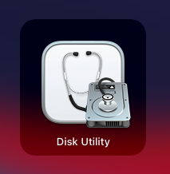
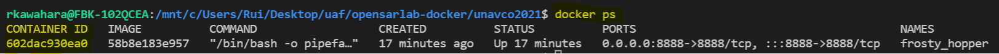

# Building the UNAVCO Docker Image and Running it in a Docker Container

Note: Currently M1 Macs are not supported. We haven't tested this on X86 Macs but believe they will work. Please let us know if you have trouble following these steps on an X86 Mac.

# (If Using Windows) Install WSL 2

WSL 2 is a paired down version of Linux running on Windows 10+.

- [WSL 2 Installation Instructions]( https://docs.microsoft.com/en-us/windows/wsl/install-win10)
    - Install the terminal as described in the final optional step on the page linked above

# Install Docker

- [Linux instructions](https://docs.docker.com/engine/install/ubuntu/) 
    - Select your linux flavor from the left sidebar menu
- [Windows Instructions using WSL 2](https://docs.docker.com/desktop/windows/install/)
    - Be sure to follow the WSL 2 backend specific instructions
- [Mac Instructions](https://docs.docker.com/desktop/mac/install/)
    - X86 Mac support only
    
# Install Git

- Install 
    - [Linux and Mac Instructions](https://git-scm.com/book/en/v2/Getting-Started-Installing-Git)
    - Windows
        - Follow the Linux instructions, running them in a WSL 2 terminal
- Create an SSH key
    - If you previously installed git outside of WSL 2, you may need to generate a new ssh key
    - [Instructions](https://docs.github.com/en/github/authenticating-to-github/connecting-to-github-with-ssh/generating-a-new-ssh-key-and-adding-it-to-the-ssh-agent)
- Register your SSH key with GitHub
    - If using WSL 2 on Windows, note that your SSH keys will be stored in /home/<user>/.ssh/
    - [Instructions](https://docs.github.com/en/github/authenticating-to-github/connecting-to-github-with-ssh/adding-a-new-ssh-key-to-your-github-account)
  

# (If Using MacOS) Create a Case-Sensitive Disc Image
- Open `Disc Utility`

    

- Create a blank image
    - Select `File -> New Image -> Blank Image...`
    
  
  
    - Fill out the image details
        - `Save As`
            - name of the `.dmg` file the image will be saved to (unavco)
        - `Where`
            - directory where `.dmg` will be saved (wherever you like)
        - `Name`
            - name of the image itself (unavco)
        - `Size`
            - amount of space available on the image (should be large enough to hold your environment and data)
        - `Format`
            - `APFS (Case-sensitive)`
        - Leave remaining fields set to their default values
    - Click the `Save` button
    
    
 
- Open a terminal
  - change directories into your mounted volume (created from your new disc image)
    - `cd /Volumes/unavco`
  - confirm case-sensitivity by creating two directories or files whose name differ only in capitalization
    - `mkdir a`
    - `mkdir A`
    - if you are able to create both files or directories, the file system is case-sensitive
    
    
     

# Clone the Git Repository to Your Computer

- If you are using Windows:
    - Open WSL2 terminal
    - Move to your Linux home directory using `cd ~/`
        - Run `pwd` to check that you are in `/home/<username>/`. At a minimum, make sure you don't have `/mnt/c/` when you use `pwd`.
    - Once you are in Linux side of WSL, run `git clone git@github.com:ASFOpenSARlab/opensarlab-docker.git` to clone the repo using ssh or `git clone https://github.com/ASFOpenSARlab/opensarlab-docker.git` to clone it using https.

- If you are using Mac OSX:
    - In a terminal, move to the case-sensitive volume you created using the instructions above
        - `cd /Volumes/unavco`
    - run `git clone git@github.com:ASFOpenSARlab/opensarlab-docker.git` to clone the repo using shh or `https://github.com/ASFOpenSARlab/opensarlab-docker.git` to clone it using https.

- If you are using Ubuntu:
    - Open your terminal
    - run `git clone git@github.com:ASFOpenSARlab/opensarlab-docker.git` to clone the repo using ssh or `https://github.com/ASFOpenSARlab/opensarlab-docker.git` to clone it using https.

### **WARNING** - Windows (WSL) and Mac OSX file systems are **case-insensitive** by default, which will cause an issue if the above operating system specific instructions are not followed.
 

# Change to the Directory Holding build_start_unavco_container.sh

- run `cd opensarlab-docker/unavco2021`

# Add Any Additional Files You Wish to Access From Your Container

- Add any files or directories you would like mounted in your container to `home/`

# Run build_start_unavco_container.sh

- run `bash build_start_unavco_container.sh 2>&1 | tee log` in the terminal
- Note that we direct output to a log file
    - If your image build or container run fails, please send this log file when you reach out for support

# Open Jupyter Notebooks in Your Browser

- After successfully running the container, you will see some URLs in your terminal

- Open the bottom URL in your browser
- Do your work
- Files you save in your home directory will be saved in your local `home/` directory and will still be accessible after the container is shut down

# Stop Your Container

- In the terminal running your container and Jupyter Server
    - In Linux and Windows, type `Ctrl + c` twice
    - In Mac OS, type `control + c` twice 

- **NOTE:** If you are using WSL 2 (i.e. Windows), you can close a terminal window without stopping any of its running processes. If you close the window where your container is running, it will stay alive and prevent you from running `build_start_unavco_container.sh` again until the container has been stopped. If this happens, complete the following steps to stop the container

    1. Use `docker ps` to check if container the is running. If it is, copy the `CONTAINER ID`. 
    1. Use `docker container stop <CONTAINER ID>` to stop your container. You should see your `CONTAINER ID` prompted when the container stops 

    
# Run the Container Again

- run `bash build_start_unavco_container.sh 2>&1 | tee log` again any time you wish to rerun the container
    - This will check for updates to the unavco conda environment every time you rerun the container
        - If there are no updates, this will take a couple of minutes
        - If there are many updates, this may take up to 35 minutes 
    - If the docker image is not deleted or modified, a cached version will run
    
# If You Encounter Issues

- Please reach out for support
- Support contact: uaf-jupyterhub-asf+unavco@alaska.edu
